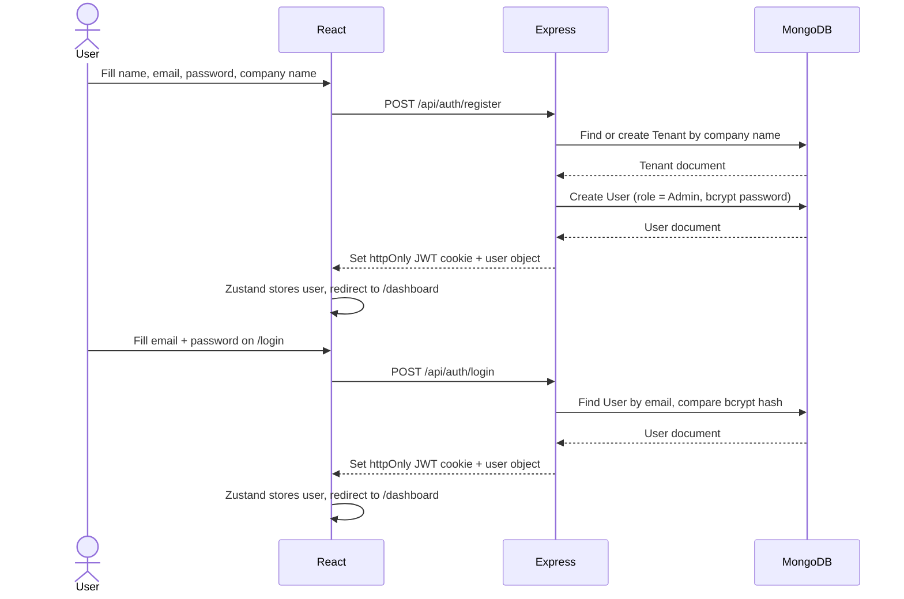
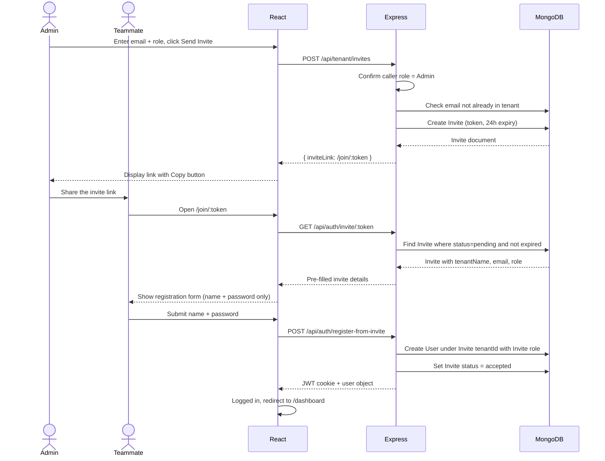
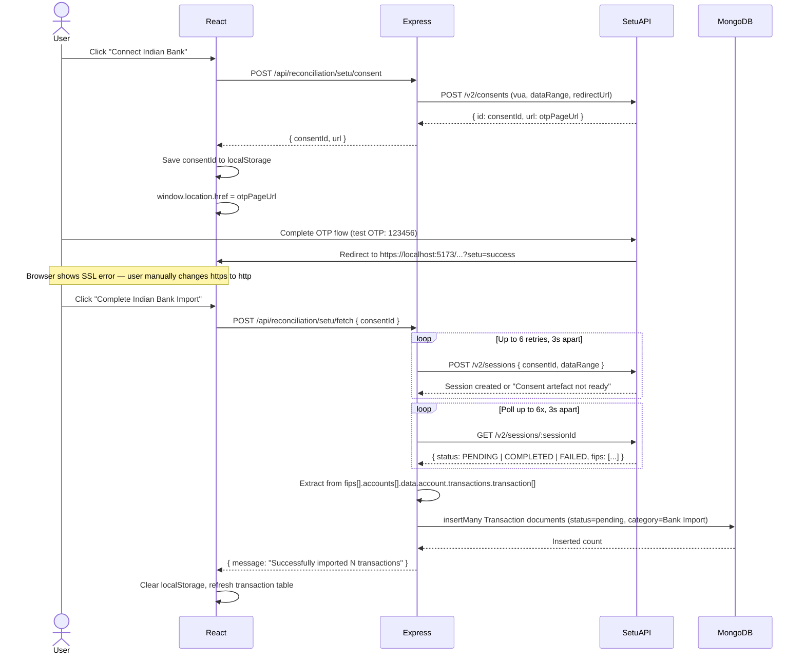
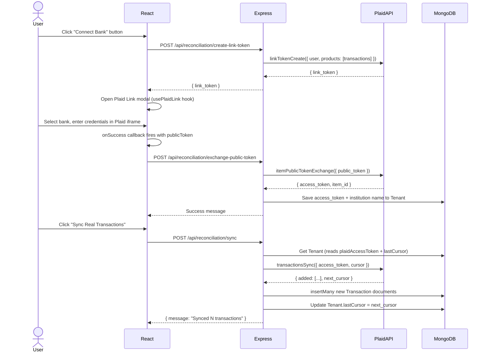
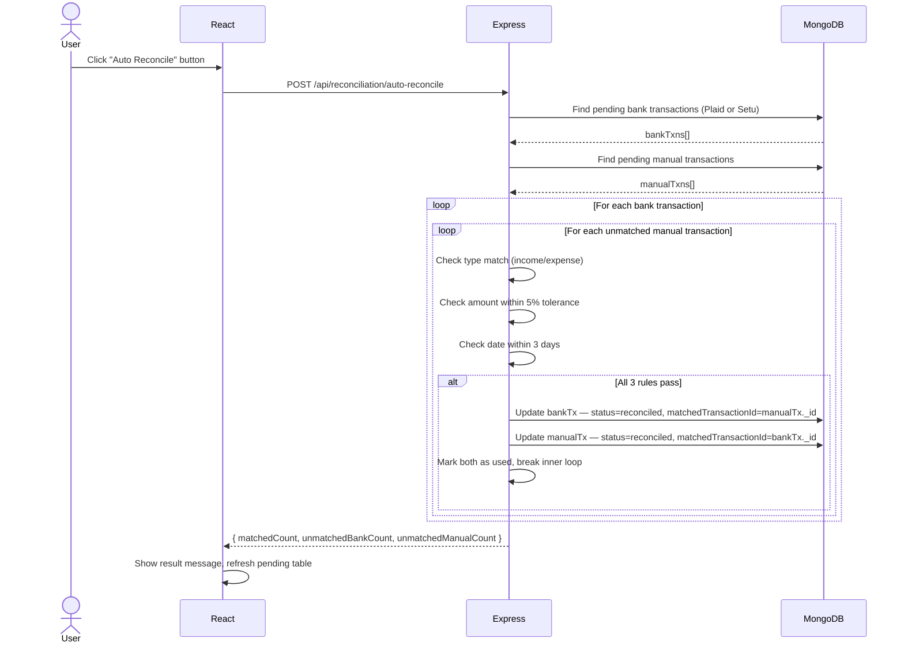

# Multi-Tenant Finance Platform

A full-stack SaaS finance management system built with the MERN stack. Multiple independent companies (tenants) can sign up, manage their transactions, connect real bank accounts, and generate financial reports — all from the same application, with strict data isolation between tenants.

---

## What This Project Does

- Each company that registers gets its own isolated workspace (tenant). Their data is never mixed with anyone else's.
- Admins can invite teammates by email. Teammates join via a one-time link and are assigned a role (Admin, Editor, or Viewer).
- Transactions come from three sources: manual simulation, Plaid (US banks via sandbox), or Setu Account Aggregator (Indian banks via AA framework).
- The reconciliation module lets users mark imported transactions as verified. The auto-reconciliation engine compares bank-imported transactions against manually entered ones and reconciles matching pairs automatically using amount and date proximity.
- **Smart Multi-Currency:** The system natively supports both US Dollars (USD) from Plaid and Indian Rupees (INR) from Setu. Dashboards and reports intelligently detect the currency based on the transaction source, providing dual-currency KPI tracking, separated regional cash flow charts, and detailed category breakdowns.
- Reports generate detailed Profit and Loss statements with dual-currency income/expense breakdowns and CSV export support.
- An audit log captures user actions, visible only to Admins.
- Transactions and Reconciliation tables feature built-in pagination for handling high volumes of data.

---

## Tech Stack

| Layer | Technology |
|---|---|
| Frontend | React 18, React Router v6, Zustand |
| Backend | Node.js, Express.js |
| Database | MongoDB with Mongoose |
| Auth | JWT stored in httpOnly cookies |
| US Bank Data | Plaid API (Sandbox) |
| Indian Bank Data | Setu Account Aggregator v2 (Sandbox) |
| Build Tool | Vite |

---

## Architecture Overview

```
┌─────────────────────────────────────────────────┐
│                   Browser (React)                │
│                                                  │
│  Zustand Auth Store  ──────  React Router        │
│         |                        |               │
│   Protected Routes          Public Routes        │
│   /dashboard/*              / /login /register   │
└──────────────────┬──────────────────────────────-┘
                   │  HTTP + Cookie (JWT)
                   ▼
┌─────────────────────────────────────────────────┐
│              Express Server (:5001)              │
│                                                  │
│  protect middleware  ──  resolveTenant middleware │
│  (verifies JWT)          (validates tenant,      │
│                           blocks suspended)      │
│                                                  │
│  /api/auth       /api/tenant    /api/transactions │
│  /api/reports    /api/audit     /api/reconciliation│
└─────┬──────────────────────┬───────────────────--┘
      │                      │
      ▼                      ▼
┌──────────┐       ┌─────────────────────┐
│ MongoDB  │       │   External APIs     │
│          │       │                     │
│ tenants  │       │  Plaid (US banks)   │
│ users    │       │  Setu AA (IN banks) │
│ txns     │       └─────────────────────┘
│ invites  │
│ audit    │
└──────────┘
```

---

## Multi-Tenancy Design

Every document in MongoDB carries a `tenantId` field. Every protected API route passes through two middleware layers before reaching any controller:

```
Request
   │
   ▼
protect()          — Verifies JWT, attaches req.user and req.tenantId
   │
   ▼
resolveTenant()    — Fetches tenant from DB, confirms it exists and is not
                     suspended, attaches req.tenant
   │
   ▼
Controller         — All queries use { tenantId: req.tenantId } as a filter,
                     so it is architecturally impossible to return another
                     tenant's data
```

The `tenantId` originates from the JWT payload at login time, not from the request body, so clients cannot spoof it.

---

## Data Models

### Tenant

```
Tenant {
  name               String  (unique — company name)
  domain             String  (optional)
  subscriptionStatus "active" | "trial" | "suspended"
  plaidAccessToken   String  (null until Plaid is connected)
  plaidInstitutionName String
  lastCursor         String  (Plaid pagination cursor)
}
```

### User

```
User {
  tenantId   ObjectId -> Tenant
  name       String
  email      String
  password   String  (bcrypt, never returned in queries)
  role       "Admin" | "Editor" | "Viewer"
}

Compound index: { tenantId, email } unique
— same email can exist in two different tenants but not twice in one
```

### Transaction

```
Transaction {
  tenantId          ObjectId -> Tenant
  userId            ObjectId -> User
  type              "income" | "expense"
  amount            Number
  category          String   (e.g. "Sales", "Software", "Bank Import")
  description       String
  date              Date
  status            "pending" | "reconciled"
  plaidTransactionId String  (null for non-Plaid transactions)
  requiresReview    Boolean
}

Compound index: { tenantId, date: -1 }
```

### Invite

```
Invite {
  tenantId   ObjectId -> Tenant
  email      String
  role       "Admin" | "Editor" | "Viewer"
  token      String  (crypto.randomBytes(32), hex)
  status     "pending" | "accepted"
  expiresAt  Date    (24 hours from creation)
}
```

---

## Request Flows

### Registration (New Company)

```
User fills /register
        │
        ▼
POST /api/auth/register
        │
        ├── Creates or finds Tenant by company name
        ├── Creates User with role = "Admin"
        ├── Hashes password with bcrypt (10 salt rounds)
        ├── Signs JWT { id, tenantId, role } — 30 day expiry
        └── Sets httpOnly cookie, returns user object (no password)
```

### Invite Flow (Adding a Teammate)

```
Admin opens Settings > Team Members
        │
        ▼
POST /api/tenant/invites  { email, role }
        │
        ├── Confirms caller is Admin
        ├── Checks email not already in this tenant
        ├── Generates 32-byte hex token
        ├── Saves Invite document (expires in 24h)
        └── Returns invite link: http://localhost:5173/join/:token

Teammate opens the link  ->  GET /api/auth/invite/:token
        │
        ├── Validates token is pending and not expired
        └── Returns { email, role, tenantName } to pre-fill the form

Teammate submits name + password  ->  POST /api/auth/register-from-invite
        │
        ├── Creates User under the Invite's tenantId with Invite's role
        ├── Marks Invite as accepted
        └── Issues JWT cookie (teammate is immediately logged in)
```

### Indian Bank Import (Setu Account Aggregator v2)

```
User clicks "Connect Indian Bank"
        │
        ▼
POST /api/reconciliation/setu/consent
        │
        ├── Calls Setu POST /v2/consents
        │   Payload: vua, consentMode=VIEW, fiTypes=[DEPOSIT],
        │            dataRange 2023-01-01 to 2026-05-01,
        │            redirectUrl = http://localhost:5173/dashboard/reconciliation?setu=success
        │
        └── Returns { url, consentId }
                │
                ▼
Frontend saves consentId to localStorage
Window redirects to Setu OTP consent page
        │
User completes OTP on Setu (test: 123456)
        │
Setu redirects back to the redirect URL
        │
        ▼
User clicks "Complete Indian Bank Import" button
(which reads consentId from localStorage)
        │
        ▼
POST /api/reconciliation/setu/fetch  { consentId }
        │
        ├── Retry loop (up to 6x, 3s apart):
        │   POST /v2/sessions  { consentId, dataRange, format: "json" }
        │   Handles "Consent artefact not ready" by waiting and retrying
        │
        ├── Polling loop (up to 6x, 3s apart):
        │   GET /v2/sessions/:id
        │   Waits for status = COMPLETED
        │   Exits immediately if status = FAILED
        │
        ├── Extracts transactions from:
        │   response.fips[].accounts[].data.account.transactions.transaction[]
        │
        └── Maps and saves to Transaction collection
            { type, amount, description: narration, category: "Bank Import",
              date: transactionTimestamp, status: "pending" }
```

### Plaid Bank Import (US Banks)

```
User clicks "Connect Bank" in the reconciliation UI
        │
        ▼
POST /api/reconciliation/create-link-token
        │  Plaid creates a short-lived link token for this user
        └── Returns { link_token }

Plaid Link modal opens in the browser (React usePlaidLink hook)
User selects their bank, enters credentials in the Plaid iframe
        │
        ▼
POST /api/reconciliation/exchange-public-token  { publicToken, metadata }
        │
        ├── Exchanges public_token for permanent access_token via Plaid API
        ├── Saves access_token and institution name to the Tenant document
        └── Returns success message

User clicks "Sync Real Transactions"
        │
        ▼
POST /api/reconciliation/sync
        │
        ├── Reads plaidAccessToken from Tenant document
        ├── Calls Plaid transactionsSync with lastCursor (for incremental sync)
        ├── Maps added[] to Transaction documents
        ├── Saves new cursor to Tenant for next sync
        └── Returns count of synced transactions
```

### Reconciliation and Reporting

```
Pending transactions appear in the Reconciliation table
        │
User clicks "Reconcile" on a row
        │
PATCH /api/reconciliation/reconcile/:id
        │
        └── Sets transaction.status = "reconciled"

Frontend Multi-Currency Report Engine (Dashboard & Reports Page)
        │
        ├── GET /api/transactions
        ├── Filters transactions by date range and status = "reconciled"
        ├── Separates by currency: USD (Plaid/Manual) vs INR (Setu Bank Import)
        ├── Computes dual-currency KPI totals (Income, Expense, Net Profit)
        ├── Generates side-by-side category breakdowns
        └── Renders separated visual charts (USD Bar Chart vs INR Bar Chart)


GET /api/reports/balance-sheet?endDate=Y
        │
        ├── Reconciled income  -> assets + equity
        ├── Reconciled expense -> assets - equity
        ├── Pending expense    -> liabilities
        └── Returns { assets, liabilities, equity }

GET /api/reports/export/csv?startDate=X&endDate=Y
        │
        └── Streams CSV of reconciled transactions via json2csv

### Auto-Reconciliation

```
User clicks "Auto Reconcile" button
        │
        ▼
POST /api/reconciliation/auto-reconcile
        │
        ├── Fetch all pending bank-imported transactions
        │   (plaidTransactionId != null OR category = "Bank Import")
        │
        ├── Fetch all pending manually-entered transactions
        │   (plaidTransactionId = null AND category != "Bank Import")
        │
        ├── For each pair, apply 3 matching rules:
        │   Rule 1 — Same type (income or expense)
        │   Rule 2 — Amount within 5% tolerance (handles bank fees/rounding)
        │   Rule 3 — Date within ±3 days (handles processing delays)
        │
        ├── On match:
        │   Set both transactions status = "reconciled"
        │   Link both via matchedTransactionId (cross-reference)
        │
        └── Returns { matchedCount, unmatchedBankCount, unmatchedManualCount }
```
```

---

## Sequence Diagrams

### Registration and Login



### Teammate Invite Flow



### Indian Bank Import 



### Plaid US Bank Sync



### Auto-Reconciliation



---

## Role-Based Access

| Action | Admin | Editor | Viewer |
|--------|-------|--------|--------|
| View dashboard and reports | Yes | Yes | Yes |
| Add/edit transactions | Yes | Yes | No |
| Reconcile transactions | Yes | Yes | No |
| Auto-reconcile transactions | Yes | Yes | No |
| Connect bank accounts | Yes | Yes | No |
| Invite team members | Yes | No | No |
| View audit logs | Yes | No | No |
| Manage tenant settings | Yes | No | No |

The `authorize(...roles)` middleware in `auth.middleware.js` enforces this at the route level.

---

## Project Structure

```
multi-tenant-finance/
├── client/                       React frontend
│   └── src/
│       ├── App.jsx               Route definitions
│       ├── layouts/
│       │   └── DashboardLayout.jsx  Collapsible sidebar, sticky logout
│       ├── pages/
│       │   ├── Home.jsx          Landing page
│       │   ├── Login.jsx
│       │   ├── Register.jsx
│       │   ├── Auth/Join.jsx     Invite acceptance page
│       │   ├── Dashboard.jsx     Summary cards (income, expense, net)
│       │   ├── Transactions/     Full transaction table with filters
│       │   ├── Reconciliation/   Bank connection + reconciliation workflow
│       │   ├── Reports/          PnL and Balance Sheet with CSV export
│       │   └── Settings/
│       │       ├── SettingsPage.jsx
│       │       ├── UsersInvites.jsx  Team management
│       │       └── AuditLogs.jsx
│       ├── store/authStore.js    Zustand store (persisted to localStorage)
│       └── services/api.js       Axios instance (credentials: include)
│
└── server/                       Express backend
    └── src/
        ├── server.js             App entry point, route mounting
        ├── config/db.js          MongoDB connection
        ├── middlewares/
        │   ├── auth.middleware.js   JWT verification, role authorization
        │   └── tenant.middleware.js Tenant resolution + suspension check
        └── modules/
            ├── auth/             Register, login, invite validation
            ├── tenant/           Tenant CRUD, invite management, user listing
            ├── transaction/      Transaction model and CRUD
            ├── reconciliation/   Plaid + Setu integrations, simulate, reconcile
            ├── reporting/        PnL, balance sheet, dashboard summary, CSV
            └── audit/            Audit log model and retrieval (Admin only)
```

---

## Running Locally

**Prerequisites:** Node.js 18+, MongoDB running on localhost:27017

```bash
# Install dependencies
cd server && npm install
cd ../client && npm install

# Start backend (port 5001, nodemon for auto-reload)
cd server && npm run dev

# Start frontend (port 5173, Vite)
cd client && npm run dev
```

**Environment variables** — create `server/.env`:

```
PORT=5001
MONGO_URI=mongodb://localhost:27017/multi-tenant-finance
JWT_SECRET=your_secret_here

# Plaid (get from dashboard.plaid.com)
PLAID_CLIENT_ID=
PLAID_SECRET=
PLAID_ENV=sandbox

# Setu (get from fiu.setu.co)
SETU_CLIENT_ID=
SETU_CLIENT_SECRET=
SETU_PRODUCT_INSTANCE_ID=
```

---

## API Reference

| Method | Endpoint | Auth | Description |
|--------|----------|------|-------------|
| POST | /api/auth/register | No | Register new user and create tenant |
| POST | /api/auth/login | No | Login, receive JWT cookie |
| POST | /api/auth/logout | No | Clear JWT cookie |
| GET | /api/auth/checkAuth | Cookie | Validate session |
| GET | /api/auth/invite/:token | No | Validate an invite token |
| POST | /api/auth/register-from-invite | No | Create account from invite |
| GET | /api/tenant/me | Yes | Get tenant details |
| GET | /api/tenant/users | Yes | List all users in tenant |
| GET | /api/tenant/invites | Yes | List all invites |
| POST | /api/tenant/invites | Admin | Create an invite |
| GET | /api/transactions | Yes | Get all transactions |
| POST | /api/transactions | Yes | Create a transaction |
| PUT | /api/transactions/:id | Yes | Update a transaction |
| DELETE | /api/transactions/:id | Yes | Delete a transaction |
| POST | /api/reconciliation/setu/consent | Yes | Start Indian bank consent flow |
| POST | /api/reconciliation/setu/fetch | Yes | Fetch and save Indian bank data |
| POST | /api/reconciliation/create-link-token | Yes | Plaid: create link token |
| POST | /api/reconciliation/exchange-public-token | Yes | Plaid: save access token |
| POST | /api/reconciliation/sync | Yes | Plaid: sync new transactions |
| POST | /api/reconciliation/simulate | Yes | Inject sample transactions |
| PATCH | /api/reconciliation/reconcile/:id | Yes | Mark one transaction reconciled |
| POST | /api/reconciliation/reconcile-all | Yes | Reconcile all pending |
| POST | /api/reconciliation/auto-reconcile | Yes | Match bank imports against manual entries by amount and date |
| GET | /api/reports/dashboard-summary | Yes | Totals for dashboard cards |
| GET | /api/reports/pnl | Yes | Profit and loss report |
| GET | /api/reports/balance-sheet | Yes | Balance sheet |
| GET | /api/reports/export/csv | Yes | Download PnL as CSV |
| GET | /api/audit | Admin | Last 50 audit log entries |

---
